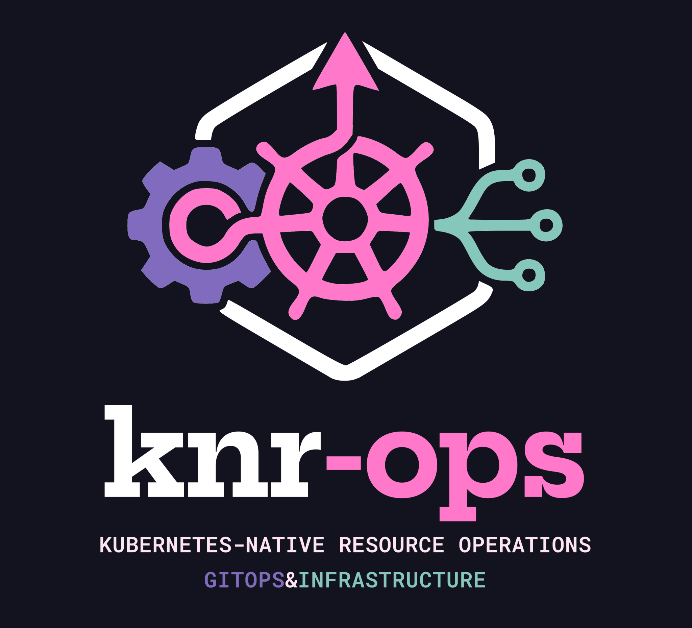
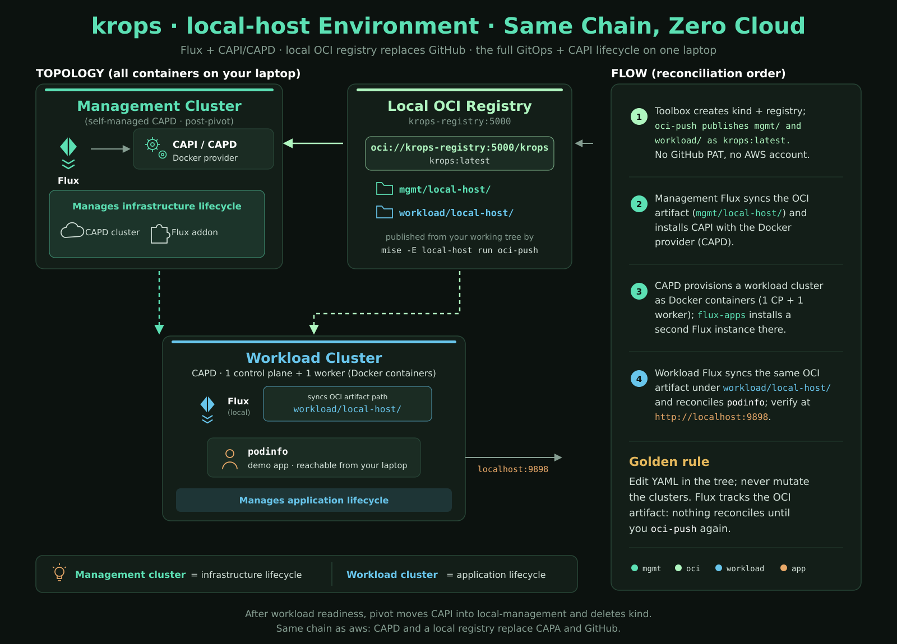
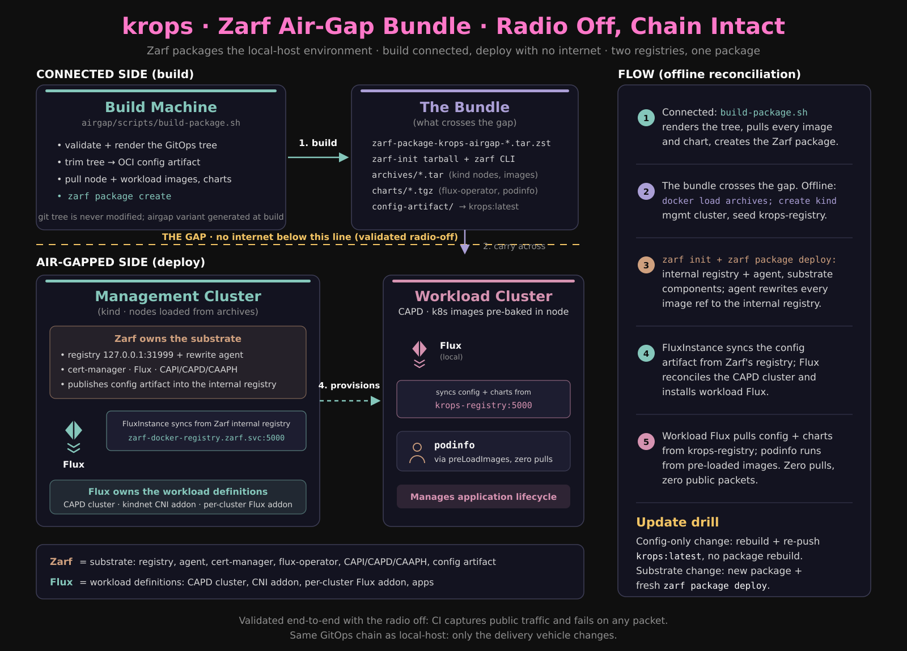

# knr-ops
## kubernetes-native resource operations



A GitOps pattern for managing cloud infrastructure through the Kubernetes API:
no Terraform, no DSLs, no state files, no second toolchain. This repository is
a working reference implementation of that pattern, with two environments:
`aws`, which runs it end-to-end on AWS EKS, and `local-host`, which runs the
same lifecycle on local clusters with no cloud account involved. **It is not a
product**: fork it, strip it down, and adapt the layout to your own cloud and
clusters.

A disposable local [kind](https://kind.sigs.k8s.io/) cluster bootstraps
[Flux](https://fluxcd.io/) and is then discarded: a CAPI pivot moves the
control plane into a self-managed management cluster that reconciles itself
and everything else from this repository. The `aws` environment reconciles:

- a self-managed EKS management cluster (provisioned by CAPA, reconciled from
  Git by the Flux instance running inside it)
- AWS EKS workload clusters provisioned via
  [CAPA](https://cluster-api-aws.sigs.k8s.io/)
- per-cluster Flux instances delivered through CAPI addons
- application workloads (the [ACK](https://aws-controllers-k8s.github.io/docs/)
  S3, RDS, and IAM operators managing secure S3 buckets, PostgreSQL instances,
  and read-only IAM roles) running on each workload cluster

The `local-host` environment walks the identical chain with the CAPD Docker
provider instead of CAPA: a local OCI registry, a one-control-plane/one-worker
workload cluster, a second Flux instance, and a Podinfo app reachable from
your laptop. It covers the complete GitOps, CAPI, and pivot lifecycle without
provisioning AWS resources.

The imperative part of the lifecycle (bootstrap, pivot, and teardown) is a
single Rust CLI, [`knr-bootstrap`](docs/bootstrap-cli.md), that replaces the
shell scripts as they complete parity runs. After the one-time bootstrap and
pivot, **everything is declared in Git as YAML**. The `aws` environment
declares 2 CAPI workload clusters: 4 node pools (ARM and GPU) across 2
regions, 2 S3 buckets, 2 RDS instances, 1 reader user, and one reader role
per workload cluster. The repository also ships a
[Zarf](https://zarf.dev/) air-gap bundle that packages the `local-host`
deployment for offline installs. 0 HCL, 0 state files.

## Who this is for

Platform engineers who already run Kubernetes and want to manage their own
cloud infrastructure with the same API, RBAC, audit trail, and GitOps workflow
they use for workloads. If you're reaching for Terraform/OpenTofu, Pulumi, or
Crossplane to stand up cloud resources for Kubernetes, this pattern is the
alternative: the cluster you already operate becomes the control plane. It is
not a developer self-service portal; you are the consumer.

## Problems the pattern solves

- **State files**: drift, locking, corruption. Controllers reconcile actual
  state continuously instead of diffing a snapshot.
- **The plan/apply gap**: PRs are reviewed as **rendered** Flux diffs (blast
  radius, image changes, render failures) by
  [konflate](https://github.com/home-operations/konflate): a GitHub Actions
  workflow runs it on every PR push as a merge gate, and an in-cluster
  instance posts the summary to the PR. You review byte-for-byte what
  reconciles. See [docs/konflate.md](docs/konflate.md).
- **Two toolchains**: HCL for infra, YAML for workloads. One control plane
  means RBAC, policy, and audit cover both.
- **Lifecycle split**: Terraform builds the cluster but can't manage what's
  in it. CAPI + Flux is one dependency graph from cluster to workload.
- **A control plane on a laptop**: the management cluster is not a long-lived
  local kind cluster. The bootstrap kind cluster is disposable, and after the
  pivot the management cluster manages itself through the same GitOps flow it
  drives.






## Prerequisites

- Mise 2026.8.10 or newer
- A running Docker engine, or Podman 5.5+, for kind; the local-host
  environment also uses it for its local OCI registry
- Rust toolchain (via [rustup](https://rustup.rs/); the exact pin lives in
  `bootstrap-rs/rust-toolchain.toml`) to build the bootstrap CLI
- AWS environment only: GitHub personal access token (PAT) with read access
  to this repo
- AWS environment only: AWS credentials and quotas established for the
  environment

## Quickstart

```sh
mise trust                  # to enable mise in this repository
mise install                # installs tools pinned in mise.toml (kubectl, kind, flux, ...)
cp .env.example .env        # AWS environment only: fill in GitHub PAT and AWS settings
mise run sops-keygen        # first time only: age key for SOPS
mise run bootstrap          # disposable kind cluster + Flux + pivot; then it is all GitOps
flux get kustomizations --watch
mise run validate           # bash -n, unit tests, build every kustomize overlay (mirrors CI)
mise run teardown           # full teardown (EKS, AWS resources, kind)
```

Dependency versions are managed by Renovate
([renovate.json5](renovate.json5)) running as the hosted GitHub App: they
live in the native files that consume them and Renovate opens update PRs
weekly; see [docs/dependencies.md](docs/dependencies.md).

### Environments (formerly profiles)

The shared toolchain is defined in `mise.toml`. AWS-specific tools are layered
through `mise.aws.toml`; use the `aws` environment when those tools are
needed. The `local-host` environment creates the management kind cluster, a
local OCI registry, and the Flux Operator and FluxInstance. It publishes the
`mgmt/local-host/` and `workload/local-host/` folders as the `knr-ops:latest`
OCI artifact. Flux installs CAPI with its Docker infrastructure provider (CAPD),
provisions a local one-control-plane/one-worker workload cluster, and installs
a separate Flux instance there. That workload Flux instance reconciles Podinfo,
providing an end-to-end local path from management-cluster bootstrap through
workload delivery and application access. This covers the complete GitOps and
CAPI lifecycle without provisioning AWS resources:

```sh
mise -E local-host install
mise -E local-host run bootstrap
mise -E local-host run oci-push  # republish local management and workload paths
mise -E local-host run kubeconfigs
mise -E local-host run podinfo-port-forward  # http://localhost:9898
mise -E local-host run teardown
```

The Flux charts are pulled anonymously. The AWS environment requires a
GitHub PAT so Flux can clone this repository; the local-host environment does
not require GitHub or AWS credentials.

`mise -E local-host run bootstrap` waits for both the management and workload
Flux reconciliation chains and surfaces workload reconciliation errors. A
successful bootstrap, followed by the Podinfo port-forward, verifies the
end-to-end local-host flow.

The local-host teardown deletes the CAPD workload cluster before deleting the
`mgmt` kind cluster and local registry container. The default teardown path
suspends Flux and removes the AWS-managed infrastructure.

## The bootstrap CLI

The imperative lifecycle steps run through a single Rust binary,
`knr-bootstrap` ([docs/bootstrap-cli.md](docs/bootstrap-cli.md)): it creates
the disposable kind cluster, hands off to Flux, and (by default) pivots the
CAPI inventory into the self-managed management cluster before deleting kind.
Reruns are safe by default (a healthy cluster is reused, every step is
idempotent), so a failed run resumes by rerunning. The shell scripts
(`bootstrap.sh`, `pivot.sh`, `teardown.sh`) remain the `mise` entrypoints
until the binary completes full parity runs per environment; the teardown port
([#100](https://github.com/polarsquad/knr-ops/issues/100)) and the
externalization of repo-specific constants into `bootstrap.toml`
([#98](https://github.com/polarsquad/knr-ops/issues/98)) are tracked issues.

## Documentation

| Page | Contents |
|---|---|
| [docs/bootstrap-cli.md](docs/bootstrap-cli.md) | The `knr-bootstrap` Rust CLI: build, interface, env knobs, pivot, parity status, roadmap |
| [docs/dependencies.md](docs/dependencies.md) | Renovate-managed dependency updates: covered surfaces, update procedure, intentional differences |
| [docs/architecture.md](docs/architecture.md) | Architecture diagram, reconciliation order, how workload apps are delivered |
| [docs/aws-iam.md](docs/aws-iam.md) | EKS Pod Identity, ACK controller IAM roles, per-cluster reader roles, the `knr-ops-reader` console user |
| [docs/workload-resources.md](docs/workload-resources.md) | S3 bucket security posture, RDS instances, known limitations |
| [docs/konflate.md](docs/konflate.md) | Rendered Flux PR review: GitHub Actions gate, in-cluster instance, write-back to PRs, tokens |
| [docs/secrets.md](docs/secrets.md) | SOPS + age secret management, key setup, credential rotation |
| [docs/operations.md](docs/operations.md) | Prerequisites, AWS service quotas, configuration, bootstrap, pivot recovery, teardown, validation |
| [docs/extending.md](docs/extending.md) | Adding a workload cluster, adding apps to the workload clusters, adding other providers (Azure, Talos, k0smotron) |
| [docs/airgap.md](docs/airgap.md) | Zarf air-gap bundle: package build, offline deploy, verification checklist, update drill |

## Repository layout

```
├── airgap/                       Zarf air-gap bundle, image inventory, scripts
├── bootstrap-rs/                 knr-bootstrap: the Rust bootstrap/pivot CLI
├── bootstrap.sh / pivot.sh /     Shell equivalents; kept until the binary
│   teardown.sh                   completes full parity runs, then retired
├── docs/                         Detailed documentation (see table above)
├── mise.toml / mise.*.toml       Pinned toolchain and AWS/local-host tasks
├── mgmt/aws/                     Synced by the MANAGEMENT cluster's Flux
│   ├── infrastructure/           cert-manager, CAPI operator, CAPA identity,
│   │                              ACK controllers, pod-identity roles,
│   │                              account-global IAM (reader console user),
│   │                              konflate (rendered Flux PR review)
│   ├── capi-providers/           capi-system, capa-system (SOPS creds),
│   │                              caaph-system
│   ├── addons/flux-apps/         Installs Flux on each workload cluster
│   │                              (HelmChartProxy + ClusterResourceSets)
│   └── clusters/                 EKS cluster defs: eu-north-1, eu-west-1
│                                  (ARM + GPU MachinePools); eu-north-1 also
│                                  carries the self-managed management cluster
├── mgmt/local-host/              OCI-synced CAPI/CAPD local workload cluster
│                                  and its management cluster definition
└── workload/                     Synced by each WORKLOAD cluster's Flux
    ├── base/                     ACK S3/RDS/IAM controllers, Bucket CRs,
    │                              DBInstance CRs, reader Role CRs
    ├── local-host/               OCI-synced Podinfo workload overlay
    ├── eu-north-01/              Per-cluster overlay (sync target)
    └── eu-west-01/               Per-cluster overlay (sync target)
```

## License

This repository is licensed under the [Apache License 2.0](LICENSE).
